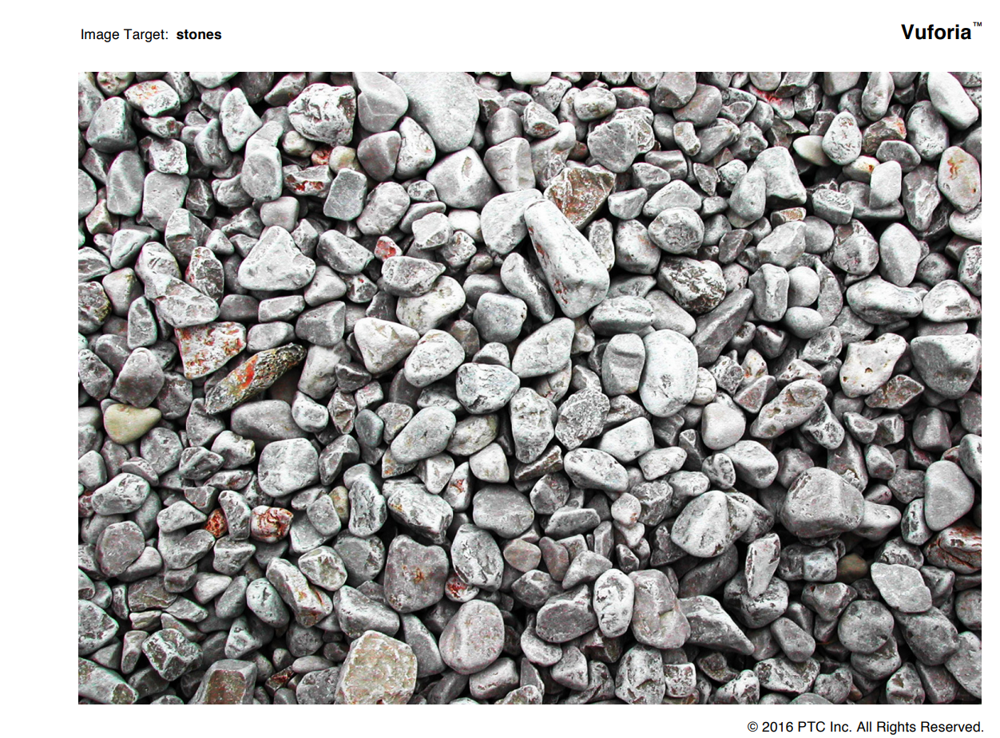

# Vuforia

[Android][Kotlin][Vuforia][AR]Vuforiaのサンプルコード(Image Target)を動かしてみた。

# Abstruct
- Vuforiaサンプルコードをビルド→動作させてみた。
- コード説明

# 背景
ちょっと思い立って、Vuforia動かしてみようかと思った。
以前この[記事](https://zenn.dev/rg687076/articles/3a27d02caadee9)で動かし方を書いたんだけど、今回動かしてみると動かねー。ビルドが通らねー。Android Gradle Pluginバージョンが8系になって過去のコードが軒並みビルドエラーになってもう大変。githubのコードが全然動かん。
Vuforiaまだサービスやってくれててよかったんだけど、公式サンプルコードもビルドが通らん。

なので、ビルドが通るようにしてgithubに公開してみた。

今回も目標到達点は↓これ


# 準備
- android端末
- 開発用PC(Android Studioのインストールは済ませておく。)
- android端末をつないで、デバッグができる様にしておく。
- SDKとサンプルコードをダウンロード
  - Vuforia SDK: https://developer.vuforia.com/downloads/sdk
  - Samples: https://developer.vuforia.com/downloads/samples
    - vuforia-sample-android-11-3-4.zip
    - vuforia-sdk-android-11-3-4.zip
- Vuforiaのアカウント作成 [前回の説明](https://zenn.dev/rg687076/articles/3a27d02caadee9)の準備1をやっておく。
- Vuforiaのライセンスキー取得 [前回の説明](https://zenn.dev/rg687076/articles/3a27d02caadee9)の準備2をやって取得しておく。

# ビルドする。
## 1. 下記に修正コードをコミットしたのでそれをDL。
https://github.com/aaaa1597/AndKot-VuforiaImageTargetSample


## 2. Android Studioでプロジェクトを開く。

開く押下


上図のAndroidプロジェクトを開く。
読み込みが完了するまで、待つ。

## 3. 認証情報を設定した後、ビルドする。
[Vuforiaのライセンス画面](https://developer.vuforia.com/vui/develop/licenses)


Android Studioで、"AppController.cpp"を開き、licenseKeyに、準備2でコピーしたライセンスを貼り付けます。
そして、ビルド。

もし、この手順を飛ばしたら、アプリ起動時に下記エラーが発生します。


## 4. マーカを印刷する。
マーカは、D:\VuforiaTest\vuforia-sdk-android-10-7-2\samples\vuforia-sample-11-3-4\Media配下にあります。
target_stones_A4.pdfを印刷しましょう。

## 5. 動かしてみる。
Android Studioをビルドして、スマホで実行。いきなりカメラ画面になります。
※Splash画面やら、Image Target/Model Terget選択画面やらうるさいので削除しました。
印刷したマーカをカメラで映すと、"目標到達点"で表示している3Dオブジェクトのキャラクタが表示されます。

**↑この画像ですね**

# ハマりポイント
ムズかった～。結構ハマってしまった。何かの情報になるかもやけん残しときます。

## 1. ビルドがなかなか通らん
- そもそも samplesのコードだけDLして SDK 側のライブラリをリンクしてなくって苦戦した。
- CMakeLists.txtの作り方も苦戦したし。
これらはAIのCopilot君に聞いたらちゃんと答えてくれたのが助かった。

## 2. #include でエラー
'#include <>' と '#include ""' この違いでエラーになってたっけ？
解せん。
```diff cpp
- #include <GLESRenderer.h>
+ #include "GLESRenderer.h"
```

## 3. vuforiaの特徴ファイル(xml,dat)読み込みエラー

```diff cpp: AppController.cpp(929,945)
-       imageTargetConfig.databasePath = "StonesAndChips.xml";
+       imageTargetConfig.databasePath = "ImageTargets/StonesAndChips.xml";
```

```diff cpp: GLESRenderer.cpp(54,68)
-       if (!readAsset(assetManager, "Astronaut.obj", data))
+       if (!readAsset(assetManager, "ImageTargets/Astronaut.obj", data))
```

app/src/main/assets配下にコピーしたんだけど、構造そのままImageTargetsフォルダの下に置いてたらエラーになって動作しなかった。パスを修正して動くようになった。
※この行って独自マーカー作ったときとか修正が必要な場所なのに、すごい分かりにくいところにあるし。
※assets配下に配置するってことはダウンロードするとか、動的に変更はできないってことじゃんね。わざとかな。

↓プロジェクト毎の変更点になるところでエラーが発生!!
```
app/
└── src/
    └── main/
        └── assets/
            ├── ImageTargets/
            │   ├── Astronaut.jpg
            │   ├── Astronaut.mtl
            │   ├── Astronaut.obj
            │   ├── StonesAndChips.dat
            │   └── StonesAndChips.xml
            └── ModelTargets/
                ├── VikingLander.jpg
                ├── VikingLander.mtl
                ├── VikingLander.obj
                ├── VuforiaMars_ModelTarget.dat
                └── VuforiaMars_ModelTarget.xml
```

## 4. Textureファイル読込みで読み込めず。。。
Texture読込みを Texture.loadTextureFromApk() で実行してるけど**Deplicated(非推奨)**になったらしく。
かなり面倒な修正になった。でそこでハマった。直接メモリじゃないとダメらしい。

↓Deplicatedのコード
```diff cpp: VuforiaActivity.cpp(339-340)
        val astronautTexture = Texture.loadTextureFromApk("Astronaut.jpg", assets)
        val landerTexture = Texture.loadTextureFromApk("VikingLander.jpg", assets)
```

↓修正コード
```cpp: MainActivity.cpp(75-81)
  val astronautbitmap = loadBitmapFromAssets(this@MainActivity, "ImageTargets/Astronaut.jpg")
  val astronautTexture: ByteBuffer? = astronautbitmap?.let { bitmap ->
                                          ByteBuffer.allocateDirect(bitmap.byteCount).apply {
                                              bitmap.copyPixelsToBuffer(this)
                                              rewind()
                                          }
                                      }
```
一旦、bitmapで読込んでから、Bytebufferに突っ込む。allocateDirect()にせんとダメらしい。
※allocate()じゃ直接メモリじゃないからダメ。

以上です。
VuforiaでARサンプルを動かす手順でした。

あんまりきれいなソースじゃないな。